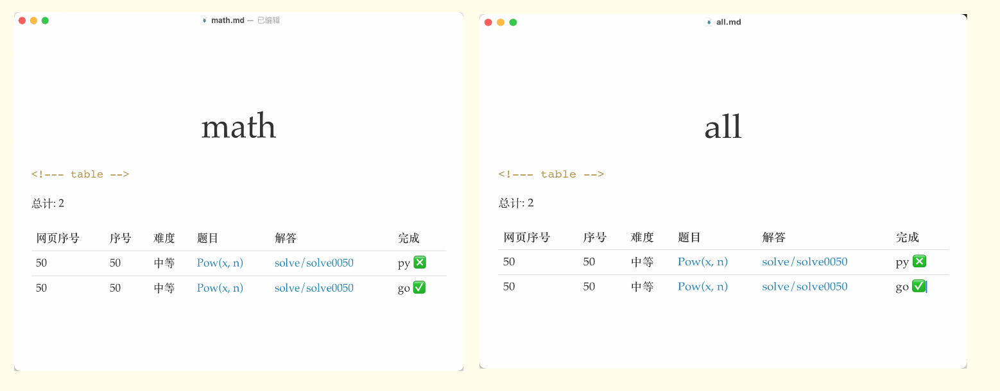
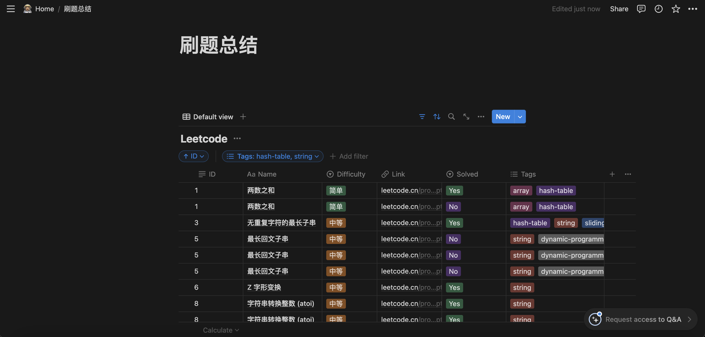

# leetcode-tool

> Leetcode 刷题助手
> Leetcode Assistant

## Features
一个GO CLI命令行工具辅助离线刷题记录。
- 离线可使用
- 自动创建Leetcode题目和代码模板
- 按题目tag整理题目
- 接入Openai辅助答题

### 题目分类



## What's Next
- [x] 接入notion api，使用notion管理做题进度

## Install

```bash
# homebrew
$ brew tap ppsteven/homebrew-tap
$ brew install ppsteven/homebrew-tap/leetcode-tool

$ leetcode-tool help
```

## Getting Started

### 1. 新建配置文件 Config
首先在创建一个做题目录，在目录下创建 `.leetcode.json` 配置文件.

```json
{
    "lang": "go/py3/ts/java", // 项目全局语言, 配置后 new 命令 --lang 参数可省略, 目前支持 go ts js py3 java
    "env": "en/cn",
    "gpt": {
    "api_key": "sk-xxx",
        "model": "gpt-3.5-turbo",
        "prompt": "您是一个算法专家，请基于下面的算法题目，给出该算法的思路和复杂度, 使用 {{ .TextLang }} 回答\nSETP1. 给出算法的归类，如递归，栈\nSETP2. 若是存在暴力解法，给出思路和复杂度\nSETP3. 给出最优解法和复杂度\nSETP4. 代码实现，使用 {{ .Lang }} 语言，代码带注释和测试样例。\n\n{{ .Problem }}"
    }
}
```
- lang: 当前支持语言 go/py3/ts/java
- env: 界面语言 cn 中文站/ en 英文站
- gpt: 支持gpt对题目提示，在没有思路的时候辅助解题
  - api_key: openai key
  - model: openai model
  - prompt: 自定义提示词，双花括号代表的是变量，在生成提示词的时候会被替换为字符串
    - {{ .TextLang }} 根据env决定，en:英文，cn:中文
    - {{ .Lang }} 编程语言
    - {{ .Problem }} 题目内容，必须加上
    - prompt 如果不填写的话，就使用如下默认prompt提示词模板

```text
您是一个算法专家，请基于下面的算法题目，给出该算法的思路和复杂度, 使用 {{ .TextLang }} 回答
SETP1. 给出算法的归类，如递归，栈
SETP2. 若是存在暴力解法，给出思路和复杂度
SETP3. 给出最优解法和复杂度
SETP4. 代码实现，使用 {{ .Lang }} 语言，代码带注释和测试样例。

{{ .Problem }}
```

### 2. 开始做题

```bash
# 1. 新建一个题目
$ leetcode-tool new 1
# 2. 写出题解, 和测试代码
...
```

下面是自动生成的题目注释，通过编辑注释信息，帮助我们分类该题的解法。
```
/**
 * @index 1
 * @title Two Sum
 * @difficulty EASY
 * @tags array,hash-table
 * @draft false
 * @link https://leetcode.cn/problems/two-sum/description/
 * @frontendId 1
 * @solved false
*/
```
- index: 题目编号
- title: 题目名称
- difficulty: 题目难易程度
- tags: 题目标签默认为Leetcode标签，同时也可以自定义标签
- draft: 是否草稿，true 则不会在update的时候对该题进行分类
- link: 题目链接
- frontendId: 题目编号
- solved: 是否解决

```bash
# 3. 更新 toc 文件
$ leetcode-tool update
# 4. 提交代码
```
### 3. 同步至Notion
在 `.leetcode.json` 中填写好 `notion_key` 和 `database_id` 或 `page_id` 后，开启更新。

注意，当第一次使用尚未创建数据库时， database_id 为空，page_id 有值时，会在 page_id 对应的父页面下自动创建数据库。

将终端显示的 `database_id` 填入配置文件后，就更新对应数据库。
```bash
$ leetcode-tool sync --notion
2024/05/05 00:56:43 Create Database: e7086c88f6504623956d1271b70aa2b4, Please add the database_id in the config file
2024/05/05 00:56:43 Visited Link: https://www.notion.so/e7086c88f6504623956d1271b70aa2b4
sync leetcode record to notion, progress: 51/52%
```



## Support Language 支持语言

- Golang go
- Typescript ts
- Javascript js
- Python3 py3
- Java java

## Usage
> [https://blog.cong.moe/post/2020-11-30-leetcode_tool](https://blog.cong.moe/post/2020-11-30-leetcode_tool)

### 新建题目代码

`leetcode-tool new [<flags>] <number>`

number 为网页上显示的题目序号, 例如: `leetcode-tool new 1` 创建第一题的代码.

此命令会创建一个文件夹和三个文件, 分别是: 代码文件, 测试文件, 题目描述文件.

题目信息从 leetcode 拉取, 并生成一些元信息供更新命令分类更新题目完成状态.

### 查看题目信息

`leetcode-tool meta <number>`

展示某道题目一些信息.

### 更新题目状态

`leetcode-tool update`

根据已完成题目类别更新 `toc` 文件夹下的算法分类状态.

### ChatGPT 辅助提示解题思路
`leetcode-tool gpt <number>`

### 更新 leetcode 分类（不建议使用）

`leetcode-tool tags`

从 leetcode 网站拉取最新分类, 并创建 `toc` 对应文件, 一般不需要运行.

### 同步 notion
`leetcode-tool sync --notion`

### 重置项目

假如想要重新从零开始, 或者你的项目是基于别人项目 fork 的, 可以使用如下方式清理已有题解:

```shell
# 1. 删除所有题解文件
rm -rf solve/*
# 2. 重新构建 toc 文件, -f 参数会强制覆盖
leetcode-tool tags -f
# 2.1 假如你还保留了部分题解, 还需要更新下题目状态
leetcode-tool update
```
## Troublesome

离线创建题目依赖 `problems.json` 文件，默认在本地无法获取该文件的时候，会从 [PPsteven/leetcode-tool/problems.json](https://raw.githubusercontent.com/PPsteven/leetcode-tool/master/problems.json) 下载。
但是国内的用户可能由于网络原因无法下载，此时需要手动下载存放在吧本地目录中。
```bash
$ go run cmd/main.go new 1
file problems.json not exists, start downloading from https://raw.githubusercontent.com/PPsteven/leetcode-tool/master/problems.json

# 手动下载存放在代码编写目录
$ wget https://raw.githubusercontent.com/PPsteven/leetcode-tool/master/problems.json
```
## 为什么需要这个工具

1. leetcode 网页 IDE 太弱了, 我需要本地解题
1. 网页题解难以沉淀, 例如一道题我希望整理多种解法
1. GitHub 易于分享题解
1. 根据自己需要, 组织题目做专题之类的总结

## 鸣谢
> https://github.com/zcong1993/leetcode-tool

此项目已多年不更新，本代码在Fork此仓库的基础上添加了如下功能：
- 离线下载了 Leetcode 3400+题，保证了在Leetcode接口发生改变后依然可以运行。
- 优化了部分代码逻辑
- 接入了Openai辅助解题

Leetcode 题目爬虫使用Python实现，详见 `scripts` 文件夹，代码参考：https://github.com/bunnyxt/lcid

## 使用此工具的项目

- [zcong1993/algo-go](https://github.com/zcong1993/algo-go)

## License

MIT &copy; ppsteven
