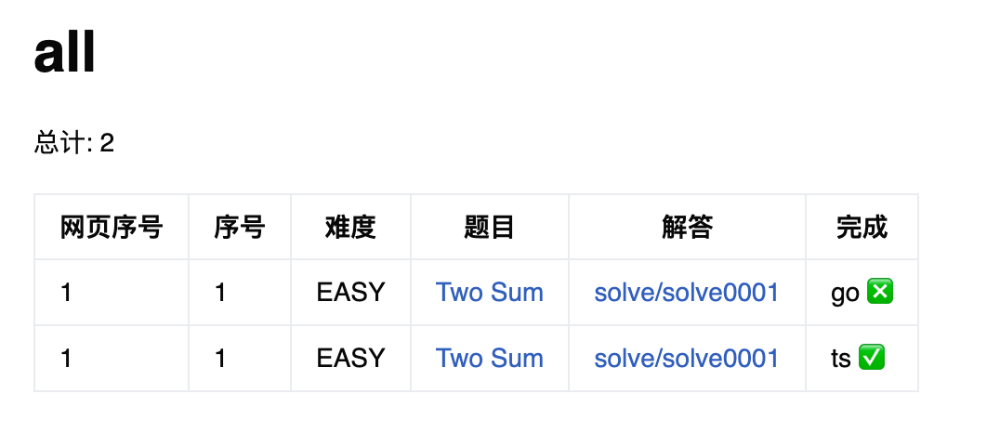

# leetcode-tool

> Leetcode 刷题助手
> Leetcode Assistant

## Introduction
一个GO CLI命令行工具辅助离线刷题记录。
功能如下：
- 显示题目信息
- 按题目tag整理分类
- 支持Openai辅助答题



## Install

```bash
# homebrew
$ brew tap ppsteven/homebrew-tap
$ brew install ppsteven/homebrew-tap/leetcode-tool

# 直接安装
curl -fsSL https://bina.egoist.sh/zcong1993/leetcode-tool | sh

# show help
$ leetcode-tool help
```

## Config 配置

可以在项目根目录创建 `.leetcode.json` 配置文件.

```js
{
    "lang": "go/py3/ts/java", // 项目全局语言, 配置后 new 命令 --lang 参数可省略, 目前支持 go ts js py3 java
    "env": "en/cn",
    "gpt": {
    "api_key": "sk-xxx",
        "model": "gpt-3.5-turbo"
    }
}
```
- lang: 当前支持语言 go/py3/ts/java
- env: 界面语言 cn 中文站/ en 英文站
- gpt: 支持gpt对题目提示，在没有思路的时候辅助解题。
  - api_key: openai key
  - model: openai model

## 使用说明

[https://blog.cong.moe/post/2020-11-30-leetcode_tool](https://blog.cong.moe/post/2020-11-30-leetcode_tool)

## 支持语言

- Golang go
- Typescript ts
- Javascript js
- Python3 py3
- Java java

## 主要功能

### 新建题目代码

`leetcode-tool new [<flags>] <number>`

number 为网页上显示的题目序号, 例如: `leetcode-tool new 1` 创建第一题的代码.

此命令会创建一个文件夹和三个文件, 分别是: 代码文件, 测试文件, 题目描述文件.

题目信息从 leetcode 拉取, 并生成一些元信息供更新命令分类更新题目完成状态.

### 查看题目信息

`leetcode-tool meta <number>`

展示某道题目一些信息.

### 更新题目状态

`leetcode-tool update`

根据已完成题目类别更新 `toc` 文件夹下的算法分类状态.

### ChatGPT 辅助提示解题思路
`leetcode-tool gpt <number>`

### 更新 leetcode 分类（不建议使用）

`leetcode-tool tags`

从 leetcode 网站拉取最新分类, 并创建 `toc` 对应文件, 一般不需要运行.

### 重置项目

假如想要重新从零开始, 或者你的项目是基于别人项目 fork 的, 可以使用如下方式清理已有题解:

```shell
# 1. 删除所有题解文件
rm -rf solve/*
# 2. 重新构建 toc 文件, -f 参数会强制覆盖
leetcode-tool tags -f
# 2.1 假如你还保留了部分题解, 还需要更新下题目状态
leetcode-tool update
```

## Workflow

如何刷题?

```bash
# 1. 新建一个题目
$ leetcode-tool new 1
# 2. 写出题解, 和测试代码
...
# 3. 更新 toc 文件
$ leetcode-tool update
# 4. 提交代码
```

题目注释如何使用

下面是自动生成的题目注释，通过编辑注释信息，帮助我们分类该题的解法。
```
/**
 * @index 1
 * @title Two Sum
 * @difficulty EASY
 * @tags array,hash-table
 * @draft false
 * @link https://leetcode.cn/problems/two-sum/description/
 * @frontendId 1
 * @solved false
*/
```
- index: 题目编号
- title: 题目名称
- difficulty: 题目难易程度
- tags: 题目标签（可以自定义标签）
- draft: 是否草稿，true 则不会在update的时候对该题进行分类
- link: 题目链接
- frontendId: 题目编号
- solved: 是否解决

## 为什么需要这个工具

1. leetcode 网页 IDE 太弱了, 我需要本地解题
1. 网页题解难以沉淀, 例如一道题我希望整理多种解法
1. GitHub 易于分享题解
1. 根据自己需要, 组织题目做专题之类的总结

## 项目参考
- 项目Fork自 https://github.com/zcong1993/leetcode-tool 此项目已多年不更新
- Leetcode 题目爬取参考：https://github.com/bunnyxt/lcid

## 使用此工具的项目

- [zcong1993/algo-go](https://github.com/zcong1993/algo-go)

## License

MIT &copy; ppsteven
